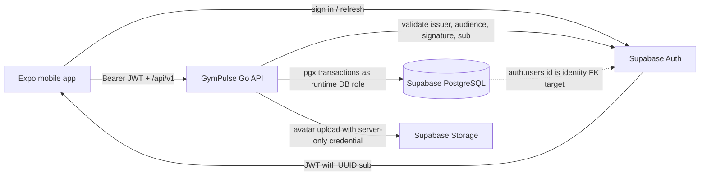
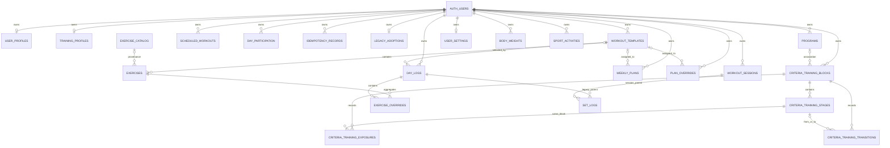
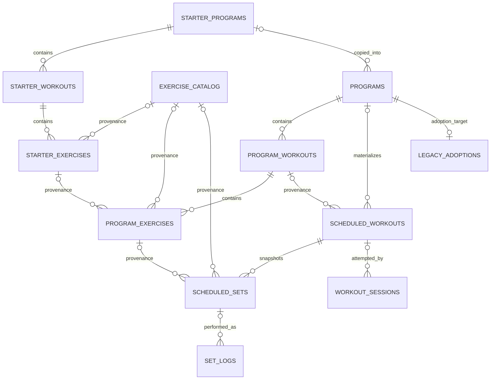

# GymPulse Database Design

**Owner**: GymPulse API
**Status**: Current schema documented through migration 019; target changes are proposals
**Last reviewed**: 2026-10-05
**Database**: PostgreSQL, hosted by Supabase
**Application boundary**: Expo client → Go API → PostgreSQL; Supabase is auth and avatar storage

## 1. Purpose and status vocabulary

This is the authoritative persistence design for GymPulse. It covers the current schema produced by
`migrations/001` through `migrations/019`, the SQL access patterns under `internal/dao`, the public
behavior in `docs/CONTRACTS.md`, and the mobile contract types in `gym-pulse-app/types/index.ts`.

The document uses three labels:

- **Current**: implemented by the checked-in migrations or application.
- **Gap**: a mismatch, missing guard, or operational behavior not proved by the repository.
- **Target**: the chosen future design. A target is not deployed until a later migration, code
  change, and PostgreSQL-backed verification land.

The current inventory contains **30 tables and 277 supported columns**. For the Supabase-managed
`auth.users` table, only the `id` column is part of GymPulse's supported persistence contract;
provider-managed columns are deliberately outside this inventory.

## 2. Design goals and non-goals

### Goals

1. Keep the authenticated UUID present in every user-owned lookup and mutation.
2. Make durable invalid states hard to represent with keys, FKs, uniqueness, and checks.
3. Preserve historical meaning with immutable snapshots while allowing provenance references to
   disappear.
4. Make retries and concurrent writes deterministic through idempotency, revisions, and short
   transactions.
5. Derive indexes from real filters, joins, ordering, cascades, and scale.
6. Support additive, forward-only schema evolution while old mobile/API versions coexist.
7. Define deletion, retention, recovery, and observability as part of the data model.

### Non-goals

- The database is not a direct mobile-client API. The Go API owns application authorization and
  business rules.
- This document does not apply the target migrations it recommends.
- Analytics warehousing, social/community graphs, billing, clinical records, and multi-region
  multi-writer storage are outside the current product.

## 3. System boundary



### Boundary rules

- Supabase Auth is the identity authority. The validated JWT `sub` UUID becomes `user_id`.
- The API never trusts a client-supplied owner. Owned queries include the authenticated UUID.
- Supabase Storage holds avatar bytes. PostgreSQL stores only the durable avatar URL.
- Application data is accessed only through the Go API. Direct Supabase Data API access is not part
  of the app architecture.
- MMKV data in the app is a cache/outbox, not a database source of truth.

## 4. Source-of-truth model

| Classification | Data | Rule |
|---|---|---|
| External | Supabase users, sessions, JWTs, avatar objects | PostgreSQL references only the user UUID and avatar URL |
| Authoritative | Profiles, settings, body weights, templates, programs, scheduled workouts, sessions, performed sets, participation, sport activities, criteria blocks/exposures/transitions | Mutated through authenticated API transactions |
| Versioned catalog | Exercise catalog and starter programs | System-owned; changes ship in reviewed migrations |
| Snapshot | User program copies, scheduled exercise/target fields, performed exercise fields | Historical values do not follow later source edits |
| Derived | Stats, streaks, distribution, volume, template exercise counts, checked-set state, stage qualification/progress | Recomputed from authoritative rows; no stats table |
| Compatibility | Legacy day logs, weekly plans, overrides, legacy adoption | Retained for installed clients and migration paths |
| Client cache | MMKV cached responses and mutation outbox | May be stale; reconciled with authoritative revisions |

## 5. Current relationship model

### Identity, preferences, catalog, and legacy logging



Migration 017 adds and validates `auth.users(id) ON DELETE CASCADE` ownership FKs for
`workout_templates`, `day_logs`, `user_settings`, `body_weights`, `weekly_plans`, and
`plan_overrides`. DAO ownership filters remain required; FK validity does not enforce same-owner
references between arbitrary application rows.

### Goal-based planning and execution



Nullable catalog/program FKs are provenance. The non-null snapshot columns on program exercises,
scheduled sets, and session-owned set logs preserve historical display and analysis.

## 6. Physical schema catalog — current

Conventions used below:

- `uuid` IDs are UUIDv4 generated with `gen_random_uuid()` unless stated otherwise.
- `timestamptz` values are stored as instants and emitted as RFC 3339.
- `date` values are calendar facts; training profile/participation timezone fields preserve their
  interpretation.
- Sensitivity: **Public**, **Account**, **Private**, **Health**, or **Operational**.
- Primary keys and unique constraints have PostgreSQL-created backing indexes even when no separate
  named index is listed.

### Table: `auth.users`

**Purpose**: Supabase-managed identity root in production; minimal compatibility stub in local
PostgreSQL. GymPulse supports only its primary key.

| Column | Type | Null/default | Meaning | Sensitivity |
|---|---|---|---|---|
| `id` | `uuid` | not null; no app default | Authenticated JWT subject | Account |

**Current constraints and indexes**

- Primary key: `id`.
- Provider-managed columns and indexes exist in hosted Supabase but are not owned or referenced by
  GymPulse migrations.

**Ownership/lifecycle**: Deletion cascades to all user-owned roots listed below. Current
account deletion leaves this row to the Supabase Admin API, after application and avatar deletion; see
[Account deletion](#12-account-deletion-and-retention).

**Migration source**: `006_create_user_profiles`.

### Table: `public.user_profiles`

**Purpose**: User display and onboarding profile.

| Column | Type | Null/default | Meaning | Sensitivity |
|---|---|---|---|---|
| `id` | `uuid` | not null | User ID and row identity | Account |
| `display_name` | `text` | nullable | User-facing name | Private |
| `avatar_url` | `text` | nullable | Public/durable avatar object URL | Private |
| `onboarding_completed` | `boolean` | not null; `false` | Monotonic onboarding flag | Private |
| `created_at` | `timestamptz` | not null; `now()` | Profile creation instant | Private |

**Current constraints and indexes**

- Primary key: `id`.
- FK `id → auth.users(id) ON DELETE CASCADE`.
- No `updated_at`; partial upsert behavior is enforced in `profile_dao.go`.

**Migration source**: `006_create_user_profiles`.

### Table: `public.user_settings`

**Purpose**: Singleton display/measurement settings.

| Column | Type | Null/default | Meaning | Sensitivity |
|---|---|---|---|---|
| `user_id` | `uuid` | not null | User ID and row identity | Account |
| `weight_unit` | `text` | not null; `'lb'` | Display/entry unit | Private |
| `weekly_goal` | `integer` | not null; `5` | Weekly workout goal | Health |
| `created_at` | `timestamptz` | not null; `now()` | First persistence instant | Private |
| `updated_at` | `timestamptz` | not null; `now()` | Last settings mutation | Private |
| `palette` | `text` | not null; `'obsidianEmber'` | App color palette | Private |

**Current constraints and indexes**

- Primary key: `user_id`.
- Check: `palette IN ('obsidianEmber', 'abyssCerulean')`.
- **Gap**: `weight_unit` and `weekly_goal` are service-validated but not database-checked.
- Validated FK `user_settings_user_auth_fk`: `user_id → auth.users(id) ON DELETE CASCADE` (017).

**Migration sources**: `005_create_user_settings`, `015_add_settings_palette`.

### Table: `public.training_profiles`

**Purpose**: Goal-based training preferences and planning inputs.

| Column | Type | Null/default | Meaning | Sensitivity |
|---|---|---|---|---|
| `user_id` | `uuid` | not null | User ID and row identity | Account |
| `primary_goal` | `text` | not null | Canonical training goal | Health |
| `available_days` | `smallint[]` | not null | ISO weekdays available for training | Health |
| `usual_activity` | `text` | not null | Baseline activity band | Health |
| `experience` | `text` | not null | Training experience band | Health |
| `equipment` | `text[]` | not null | Available equipment | Private |
| `session_duration_minutes` | `integer` | not null | Preferred session duration | Health |
| `timezone` | `text` | not null | IANA timezone used for local training dates | Private |
| `preferences` | `jsonb` | not null; `{}` | Forward-compatible training preferences | Health |
| `revision` | `bigint` | not null; `1` | Optimistic concurrency revision | Operational |
| `created_at` | `timestamptz` | not null; `now()` | Creation instant | Private |
| `updated_at` | `timestamptz` | not null; `now()` | Last mutation instant | Private |

**Current constraints and indexes**

- Primary key and FK: `user_id → auth.users(id) ON DELETE CASCADE`.
- Goal check: `general_health|strength|hypertrophy|conditioning|power|body_composition`.
- `available_days`: cardinality 1–7 and values limited to 1–7.
- Activity: `sedentary|light|moderate|high`.
- Experience: `beginner|intermediate|advanced`.
- Duration: 20–120 minutes.
- Revision: `> 0`.
- **Gap**: the array check permits duplicate weekdays; service validation rejects them.

**Migration source**: `012_create_training_domain`.

### Table: `public.body_weights`

**Purpose**: One body-weight measurement per user/calendar date.

| Column | Type | Null/default | Meaning | Sensitivity |
|---|---|---|---|---|
| `id` | `uuid` | not null; generated | Measurement identity | Health |
| `user_id` | `uuid` | not null | Owner | Account |
| `date` | `date` | not null | Measurement calendar date | Health |
| `weight` | `numeric(5,2)` | not null | Exact entered weight | Health |
| `unit` | `text` | not null | Unit captured with the value | Health |
| `logged_at` | `timestamptz` | not null; `now()` | Last upsert instant | Health |

**Current constraints and indexes**

- Primary key: `id`.
- Unique: `(user_id, date)`.
- Check: `unit IN ('lb', 'kg')`.
- Named index `idx_body_weights_user(user_id)`; the unique index also supports user/date ordering.
- **Gap**: positive weight is service-validated but not database-checked.
- Validated FK `body_weights_user_auth_fk`: `user_id → auth.users(id) ON DELETE CASCADE` (017).

**Migration source**: `007_create_body_weights`.

### Table: `public.exercise_catalog`

**Purpose**: System-curated, read-only exercise catalog.

| Column | Type | Null/default | Meaning | Sensitivity |
|---|---|---|---|---|
| `id` | `uuid` | not null; generated | Catalog identity | Public |
| `name` | `text` | not null | Display name | Public |
| `category` | `text` | not null | Workout category/type | Public |
| `modality` | `text` | not null | Strength or cardio | Public |
| `mechanic` | `text` | nullable | Compound/isolation for strength | Public |
| `sort_order` | `integer` | not null; `0` | Order within category | Public |

**Current constraints and indexes**

- Primary key: `id`.
- Unique: `(category, name)`.
- Modality: `strength|cardio`; mechanic: `compound|isolation`.
- Shape check: strength requires a mechanic; cardio requires `NULL` mechanic.
- Named index `idx_exercise_catalog_category(category)`.

**Lifecycle**: Changes and seed additions ship as migrations; there is no public write endpoint.

**Migration source**: `008_create_exercise_catalog`.

### Table: `public.workout_templates`

**Purpose**: User-owned reusable legacy workout template.

| Column | Type | Null/default | Meaning | Sensitivity |
|---|---|---|---|---|
| `id` | `uuid` | not null; generated | Template identity | Private |
| `user_id` | `uuid` | not null | Owner | Account |
| `name` | `text` | not null | User template name | Private |
| `type_id` | `text` | not null | Workout type | Health |
| `subtype_id` | `text` | not null; `'general'` | Workout subtype | Health |
| `created_at` | `timestamptz` | not null; `now()` | Creation instant | Private |
| `updated_at` | `timestamptz` | not null; `now()` | Last replacement instant | Private |

**Current constraints and indexes**

- Primary key: `id`.
- Named indexes `idx_templates_user(user_id)` and
  `idx_templates_user_type(user_id, type_id)`.
- Type and subtype vocabularies are service-validated, not database-checked.
- Validated FK `workout_templates_user_auth_fk`: `user_id → auth.users(id) ON DELETE CASCADE` (017).

**Mutation model**: Updating a template replaces all child exercise rows in one transaction. Past
scheduled/performed snapshots do not change.

**Migration source**: `001_create_workout_templates`.

### Table: `public.exercises`

**Purpose**: Ordered exercise prescription inside a legacy template.

| Column | Type | Null/default | Meaning | Sensitivity |
|---|---|---|---|---|
| `id` | `uuid` | not null; generated | Template-exercise identity | Private |
| `template_id` | `uuid` | not null | Parent template | Private |
| `name` | `text` | not null | Exercise snapshot/display name | Health |
| `sort_order` | `integer` | not null; `0` | Zero-based template order | Private |
| `sets` | `integer` | nullable | Strength set target | Health |
| `reps` | `integer` | nullable | Strength repetition target | Health |
| `weight` | `numeric(7,2)` | nullable | Optional target weight | Health |
| `rest_seconds` | `integer` | nullable | Rest target | Health |
| `notes` | `text` | nullable | User prescription notes | Health |
| `catalog_id` | `uuid` | nullable | Catalog provenance | Public |
| `duration_minutes` | `integer` | nullable | Cardio duration target | Health |
| `intensity` | `text` | nullable | Cardio intensity | Health |

**Current constraints and indexes**

- Primary key: `id`.
- FK `template_id → workout_templates(id) ON DELETE CASCADE`.
- FK `catalog_id → exercise_catalog(id) ON DELETE SET NULL`.
- Check: `intensity IN ('easy', 'moderate', 'hard')`.
- Named index `idx_exercises_template(template_id)`.
- Strength-versus-cardio exclusivity and positive targets are service-validated, not
  database-checked.

**Migration sources**: `002_create_exercises`, `009_alter_exercises_cardio`.

### Table: `public.day_logs`

**Purpose**: Legacy date-oriented workout/rest record.

| Column | Type | Null/default | Meaning | Sensitivity |
|---|---|---|---|---|
| `id` | `uuid` | not null; generated | Legacy log identity | Health |
| `user_id` | `uuid` | not null | Owner | Account |
| `date` | `date` | not null | Workout calendar date | Health |
| `type_id` | `text` | not null | Workout/rest type | Health |
| `subtype_id` | `text` | not null; `'general'` | Workout subtype | Health |
| `template_id` | `uuid` | nullable | Optional template provenance | Private |
| `session_notes` | `text` | nullable | User session notes | Health |
| `logged_at` | `timestamptz` | not null; `now()` | Creation instant | Health |

**Current constraints and indexes**

- Primary key: `id`.
- FK `template_id → workout_templates(id) ON DELETE SET NULL`.
- Named index `idx_logs_user_date(user_id, date)`.
- Migration 003 created unique `(user_id, date)`; migration 012 dropped it.
- **P0 gap**: the current API still creates, gets, updates, and deletes a singular log by date and
  maps duplicate insert to `409`. Without uniqueness, duplicate rows are possible, `QueryRow` is
  nondeterministic, and date deletion removes all matches. The target restores unique
  `(user_id, date)` after duplicate audit/repair.
- Validated FK `day_logs_user_auth_fk`: `user_id → auth.users(id) ON DELETE CASCADE` (017).

**Migration sources**: `003_create_day_logs`, uniqueness changed by
`012_create_training_domain`.

### Table: `public.exercise_overrides`

**Purpose**: Legacy per-exercise aggregates, notes, and skipped state for a day log.

| Column | Type | Null/default | Meaning | Sensitivity |
|---|---|---|---|---|
| `id` | `uuid` | not null; generated | Override identity | Health |
| `day_log_id` | `uuid` | not null | Parent log | Health |
| `exercise_id` | `uuid` | not null | Owned template exercise | Health |
| `actual_sets` | `integer` | nullable | Aggregate performed sets | Health |
| `actual_reps` | `integer` | nullable | Aggregate repetitions | Health |
| `actual_weight` | `numeric(7,2)` | nullable | Aggregate weight | Health |
| `notes` | `text` | nullable | Per-exercise notes | Health |
| `skipped` | `boolean` | nullable; `false` | Skipped marker | Health |

**Current constraints and indexes**

- Primary key: `id`.
- FK `day_log_id → day_logs(id) ON DELETE CASCADE`.
- FK `exercise_id → exercises(id) ON DELETE CASCADE`.
- Named index `idx_overrides_log(day_log_id)`.
- **Gap**: no unique `(day_log_id, exercise_id)` and `skipped` is not `NOT NULL`.

**Migration source**: `004_create_exercise_overrides`.

### Table: `public.set_logs`

**Purpose**: Shared per-set performance history. Each row belongs to exactly one legacy day log or
goal-based workout session.

| Column | Type | Null/default | Meaning | Sensitivity |
|---|---|---|---|---|
| `id` | `uuid` | not null; generated | Performed-set identity | Health |
| `day_log_id` | `uuid` | nullable | Legacy parent | Health |
| `exercise_id` | `uuid` | nullable | Legacy exercise provenance | Health |
| `set_index` | `integer` | not null | One-based set order | Health |
| `target_reps` | `integer` | nullable | Captured repetition target | Health |
| `target_weight` | `numeric(7,2)` | nullable | Captured weight target | Health |
| `actual_reps` | `integer` | nullable | Performed repetitions | Health |
| `actual_weight` | `numeric(7,2)` | nullable | Performed weight | Health |
| `duration_seconds` | `integer` | nullable | Performed cardio duration | Health |
| `completed` | `boolean` | not null; `false` | Counts as performed | Health |
| `logged_at` | `timestamptz` | not null; `now()` | Last insert/upsert instant | Health |
| `workout_session_id` | `uuid` | nullable | Goal-based parent | Health |
| `scheduled_set_id` | `uuid` | nullable | Required-set provenance | Health |
| `is_extra` | `boolean` | not null; `true` | Required versus extra set | Health |
| `exercise_name` | `text` | not null | Immutable display snapshot | Health |
| `exercise_category` | `text` | not null | Immutable category snapshot | Health |
| `exercise_modality` | `text` | not null | Immutable strength/cardio snapshot | Health |
| `operation_key` | `text` | nullable | Client retry identity | Operational |
| `revision` | `bigint` | not null; `1` | Per-set optimistic revision | Operational |

**Current constraints and indexes**

- Primary key: `id`.
- FKs: `day_log_id → day_logs CASCADE`, `workout_session_id → workout_sessions CASCADE`,
  `exercise_id → exercises SET NULL`, `scheduled_set_id → scheduled_sets SET NULL`.
- Legacy unique: `(day_log_id, exercise_id, set_index)`.
- Exactly one parent: `num_nonnulls(day_log_id, workout_session_id) = 1`.
- Required/extra: extra implies no scheduled set; required implies a scheduled set.
- Modality: `strength|cardio`; revision `> 0`.
- Named indexes `idx_setlogs_log(day_log_id)` and `idx_setlogs_exercise(exercise_id)`.
- Partial unique `idx_setlogs_session_operation(workout_session_id, operation_key) WHERE
  operation_key IS NOT NULL`.
- Partial unique `idx_setlogs_required_result(workout_session_id, scheduled_set_id) WHERE
  scheduled_set_id IS NOT NULL`.
- **Gap**: session-owned reads by `workout_session_id` lack a complete parent index; both partial
  unique indexes exclude some rows or predicates.
- **Gap**: positive set index/targets/actuals, completed-value shape, and required operation keys are
  service-validated but not fully database-checked.

**Migration sources**: `011_create_set_logs`, extended by `012_create_training_domain`.

### Table: `public.weekly_plans`

**Purpose**: Legacy recurring weekly template/rest assignment.

| Column | Type | Null/default | Meaning | Sensitivity |
|---|---|---|---|---|
| `id` | `uuid` | not null; generated | Assignment identity | Private |
| `user_id` | `uuid` | not null | Owner | Account |
| `weekday` | `integer` | not null | ISO weekday 1–7 | Health |
| `template_id` | `uuid` | nullable | Assigned template | Private |
| `rest` | `boolean` | not null; `false` | Explicit rest day | Health |

**Current constraints and indexes**

- Primary key: `id`; unique `(user_id, weekday)`.
- FK `template_id → workout_templates(id) ON DELETE SET NULL`.
- Weekday 1–7; rest and non-null template cannot coexist.
- Named index `idx_weekly_plans_user(user_id)`.
- Validated FK `weekly_plans_user_auth_fk`: `user_id → auth.users(id) ON DELETE CASCADE` (017).

**Migration source**: `010_create_weekly_plans`.

### Table: `public.plan_overrides`

**Purpose**: Legacy one-date template/rest override.

| Column | Type | Null/default | Meaning | Sensitivity |
|---|---|---|---|---|
| `id` | `uuid` | not null; generated | Override identity | Private |
| `user_id` | `uuid` | not null | Owner | Account |
| `date` | `date` | not null | Override date | Health |
| `template_id` | `uuid` | nullable | Assigned template | Private |
| `rest` | `boolean` | not null; `false` | Explicit rest day | Health |

**Current constraints and indexes**

- Primary key: `id`; unique `(user_id, date)`.
- FK `template_id → workout_templates(id) ON DELETE SET NULL`.
- Rest and non-null template cannot coexist.
- Named index `idx_plan_overrides_user_date(user_id, date)`.
- Validated FK `plan_overrides_user_auth_fk`: `user_id → auth.users(id) ON DELETE CASCADE` (017).

**Migration source**: `010_create_weekly_plans`.

### Table: `public.starter_programs`

**Purpose**: Versioned system catalog of starter training programs.

| Column | Type | Null/default | Meaning | Sensitivity |
|---|---|---|---|---|
| `id` | `uuid` | not null; generated | Starter version identity | Public |
| `slug` | `text` | not null | Stable program family key | Public |
| `version` | `integer` | not null | Immutable positive version | Public |
| `name` | `text` | not null | Display name | Public |
| `description` | `text` | not null; `''` | Program description | Public |
| `primary_goal` | `text` | not null | Goal classification | Public |
| `min_days` | `smallint` | not null | Minimum weekly availability | Public |
| `max_days` | `smallint` | not null | Maximum weekly availability | Public |
| `experience` | `text[]` | not null; `{}` | Matching experience values | Public |
| `equipment` | `text[]` | not null; `{}` | Matching equipment values | Public |
| `duration_minutes` | `integer` | not null | Expected session duration | Public |
| `rationale` | `text` | not null; `''` | Recommendation rationale | Public |
| `roadmap` | `jsonb` | not null; `{}` | Versioned program roadmap | Public |
| `active` | `boolean` | not null; `true` | Discoverable version flag | Public |
| `created_at` | `timestamptz` | not null; `now()` | Catalog creation instant | Operational |

**Current constraints and indexes**

- Primary key: `id`; unique `(slug, version)`.
- Version `> 0`; min/max days within 1–7 and `max_days >= min_days`.
- Goal vocabulary matches training profiles.
- Duration 20–120 minutes.
- Starter list filters may scan this small curated catalog; no speculative array/JSON index.

**Lifecycle**: Published versions are treated as immutable. New content receives a new version; old
versions remain addressable for copy provenance.

**Migration sources**: `012_create_training_domain`, seeded by
`013_seed_starter_programs`.

### Table: `public.starter_workouts`

**Purpose**: Ordered workout within a starter-program version.

| Column | Type | Null/default | Meaning | Sensitivity |
|---|---|---|---|---|
| `id` | `uuid` | not null; generated | Starter workout identity | Public |
| `starter_program_id` | `uuid` | not null | Parent version | Public |
| `name` | `text` | not null | Display name | Public |
| `weekday` | `smallint` | nullable | Preferred ISO weekday | Public |
| `sequence_position` | `integer` | not null | Positive order in program | Public |

**Current constraints and indexes**

- Primary key: `id`.
- FK `starter_program_id → starter_programs(id) ON DELETE CASCADE`.
- Unique `(starter_program_id, sequence_position)`; weekday 1–7 when present; position `> 0`.
- The unique backing index supports parent loading ordered by sequence.

**Migration source**: `012_create_training_domain`.

### Table: `public.starter_exercises`

**Purpose**: Ordered exercise prescription in a starter workout.

| Column | Type | Null/default | Meaning | Sensitivity |
|---|---|---|---|---|
| `id` | `uuid` | not null; generated | Starter exercise identity | Public |
| `starter_workout_id` | `uuid` | not null | Parent workout | Public |
| `catalog_id` | `uuid` | nullable | Catalog provenance | Public |
| `name` | `text` | not null | Immutable display name | Public |
| `category` | `text` | not null | Immutable category | Public |
| `modality` | `text` | not null | Strength/cardio | Public |
| `exercise_order` | `integer` | not null | Positive order | Public |
| `target_sets` | `integer` | not null | Positive set count | Public |
| `target_reps` | `integer` | nullable | Repetition target | Public |
| `target_weight` | `numeric(9,2)` | nullable | Weight target | Public |
| `target_duration_seconds` | `integer` | nullable | Duration target | Public |
| `rest_seconds` | `integer` | nullable | Rest target | Public |
| `notes` | `text` | nullable | Prescription notes | Public |

**Current constraints and indexes**

- Primary key: `id`.
- FK `starter_workout_id → starter_workouts CASCADE`; FK `catalog_id → exercise_catalog SET NULL`.
- Unique `(starter_workout_id, exercise_order)`.
- Modality `strength|cardio`; order and set count `> 0`.
- At least one of repetition or duration target is present.
- **Gap**: the check allows both targets and does not enforce modality-specific/positive targets.
- **Gap**: no child-side index beginning with `catalog_id`.

**Migration source**: `012_create_training_domain`.

### Table: `public.programs`

**Purpose**: User-owned custom program or immutable copy of a starter version.

| Column | Type | Null/default | Meaning | Sensitivity |
|---|---|---|---|---|
| `id` | `uuid` | not null; generated | Program identity | Health |
| `user_id` | `uuid` | not null | Owner | Account |
| `starter_program_id` | `uuid` | nullable | Source starter provenance | Public |
| `starter_version` | `integer` | nullable | Copied starter version | Public |
| `name` | `text` | not null | User program name | Health |
| `primary_goal` | `text` | not null | Program goal | Health |
| `roadmap` | `jsonb` | not null; `{}` | User program roadmap | Health |
| `active` | `boolean` | not null; `true` | Current-program marker | Health |
| `revision` | `bigint` | not null; `1` | Optimistic concurrency revision | Operational |
| `created_at` | `timestamptz` | not null; `now()` | Creation instant | Private |
| `updated_at` | `timestamptz` | not null; `now()` | Last replacement/activation | Private |

**Current constraints and indexes**

- Primary key: `id`.
- FK `user_id → auth.users CASCADE`; FK `starter_program_id → starter_programs SET NULL`.
- Goal vocabulary matches training profiles; revision `> 0`.
- Named index `idx_programs_user(user_id)`.
- Partial unique `idx_programs_one_active_per_user(user_id) WHERE active=true`.
- **Gap**: `starter_program_id` and `starter_version` may be independently null/non-null.

**Mutation model**: Create/replace takes a per-user program advisory lock, deactivates the prior
active program when necessary, changes the revision, and replaces all child workouts/exercises.

**Migration sources**: `012_create_training_domain`; one-active invariant added by
`014_guided_experience_contracts`.

### Table: `public.program_workouts`

**Purpose**: Ordered workout in a user-owned program snapshot.

| Column | Type | Null/default | Meaning | Sensitivity |
|---|---|---|---|---|
| `id` | `uuid` | not null; generated | Program workout identity | Health |
| `program_id` | `uuid` | not null | Parent program | Health |
| `name` | `text` | not null | Workout name snapshot | Health |
| `preferred_weekday` | `smallint` | nullable | Preferred ISO weekday | Health |
| `sequence_position` | `integer` | not null | Positive program order | Health |

**Current constraints and indexes**

- Primary key: `id`.
- FK `program_id → programs(id) ON DELETE CASCADE`.
- Unique `(program_id, sequence_position)`.
- Weekday 1–7 when present; sequence position `> 0`.

**Migration source**: `012_create_training_domain`.

### Table: `public.program_exercises`

**Purpose**: Ordered exercise snapshot in a user-owned program workout.

| Column | Type | Null/default | Meaning | Sensitivity |
|---|---|---|---|---|
| `id` | `uuid` | not null; generated | Program exercise identity | Health |
| `program_workout_id` | `uuid` | not null | Parent workout | Health |
| `catalog_id` | `uuid` | nullable | Catalog provenance | Public |
| `source_starter_exercise_id` | `uuid` | nullable | Starter provenance | Public |
| `name` | `text` | not null | Immutable display snapshot | Health |
| `category` | `text` | not null | Immutable category snapshot | Health |
| `modality` | `text` | not null | Strength/cardio snapshot | Health |
| `exercise_order` | `integer` | not null | Positive order | Health |
| `target_sets` | `integer` | not null | Positive set count | Health |
| `target_reps` | `integer` | nullable | Repetition target | Health |
| `target_weight` | `numeric(9,2)` | nullable | Weight target | Health |
| `target_duration_seconds` | `integer` | nullable | Duration target | Health |
| `rest_seconds` | `integer` | nullable | Rest target | Health |
| `notes` | `text` | nullable | User prescription notes | Health |

**Current constraints and indexes**

- Primary key: `id`.
- FK `program_workout_id → program_workouts CASCADE`.
- FKs `catalog_id → exercise_catalog SET NULL` and
  `source_starter_exercise_id → starter_exercises SET NULL`.
- Unique `(program_workout_id, exercise_order)`.
- Modality `strength|cardio`; order and target sets `> 0`.
- At least one of repetition or duration target is present.
- **Gap**: modality shape/positive targets are not fully database-enforced.
- **Gap**: provenance FKs have no child-side indexes.

**Migration source**: `012_create_training_domain`.

### Table: `public.scheduled_workouts`

**Purpose**: Dated materialized workout snapshot and authoritative planned outcome.

| Column | Type | Null/default | Meaning | Sensitivity |
|---|---|---|---|---|
| `id` | `uuid` | not null; generated | Scheduled workout identity | Health |
| `user_id` | `uuid` | not null | Owner | Account |
| `program_id` | `uuid` | nullable | Program provenance | Health |
| `program_workout_id` | `uuid` | nullable | Program-workout provenance | Health |
| `date` | `date` | not null | Scheduled local calendar date | Health |
| `name` | `text` | not null | Immutable workout name snapshot | Health |
| `sequence_position` | `integer` | nullable | Program sequence position | Health |
| `status` | `text` | not null; `'planned'` | Planned/finalized outcome | Health |
| `finalized_at` | `timestamptz` | nullable | Outcome finalization instant | Health |
| `revision` | `bigint` | not null; `1` | Optimistic concurrency revision | Operational |
| `created_at` | `timestamptz` | not null; `now()` | Materialization instant | Private |
| `updated_at` | `timestamptz` | not null; `now()` | Last snapshot/outcome change | Private |

**Current constraints and indexes**

- Primary key: `id`.
- FK `user_id → auth.users CASCADE`.
- FKs `program_id → programs SET NULL` and `program_workout_id → program_workouts SET NULL`.
- Status: `planned|in_progress|completed|incomplete|missed`; revision `> 0`.
- Named index `idx_scheduled_workouts_user_date(user_id, date)`.
- **Gap**: no DB check ties finalized states to `finalized_at`.
- **Gap**: no provenance FK indexes.

**Migration source**: `012_create_training_domain`.

### Table: `public.scheduled_sets`

**Purpose**: Immutable dated set target snapshot under a scheduled workout.

| Column | Type | Null/default | Meaning | Sensitivity |
|---|---|---|---|---|
| `id` | `uuid` | not null; generated | Scheduled-set identity | Health |
| `scheduled_workout_id` | `uuid` | not null | Parent scheduled workout | Health |
| `program_exercise_id` | `uuid` | nullable | Program-exercise provenance | Health |
| `catalog_id` | `uuid` | nullable | Catalog provenance | Public |
| `exercise_name` | `text` | not null | Immutable display snapshot | Health |
| `exercise_category` | `text` | not null | Immutable category snapshot | Health |
| `exercise_modality` | `text` | not null | Strength/cardio snapshot | Health |
| `exercise_order` | `integer` | not null | Positive exercise order | Health |
| `set_index` | `integer` | not null | Positive set order | Health |
| `target_reps` | `integer` | nullable | Repetition target | Health |
| `target_weight` | `numeric(9,2)` | nullable | Weight target | Health |
| `target_duration_seconds` | `integer` | nullable | Duration target | Health |
| `rest_seconds` | `integer` | nullable | Rest target | Health |
| `notes` | `text` | nullable | Dated prescription notes | Health |
| `created_at` | `timestamptz` | not null; `now()` | Snapshot creation instant | Private |

**Current constraints and indexes**

- Primary key: `id`.
- FK `scheduled_workout_id → scheduled_workouts CASCADE`.
- FKs `program_exercise_id → program_exercises SET NULL` and
  `catalog_id → exercise_catalog SET NULL`.
- Unique `(scheduled_workout_id, exercise_order, set_index)`.
- Modality `strength|cardio`; exercise order/set index `> 0`.
- At least one of repetition or duration target is present.
- The unique backing index supports ordered parent loads.
- **Gap**: modality shape/positive targets are not fully database-enforced.
- **Gap**: provenance FKs have no child-side indexes.

**Migration source**: `012_create_training_domain`.

### Table: `public.workout_sessions`

**Purpose**: UUID-addressed performed workout; multiple sessions may share a calendar date.

| Column | Type | Null/default | Meaning | Sensitivity |
|---|---|---|---|---|
| `id` | `uuid` | not null; generated | Session identity | Health |
| `user_id` | `uuid` | not null | Owner | Account |
| `scheduled_workout_id` | `uuid` | nullable | Optional planned-workout provenance | Health |
| `date` | `date` | not null | Session local calendar date | Health |
| `name` | `text` | not null | Session name | Health |
| `status` | `text` | not null; `'draft'` | Session lifecycle state | Health |
| `notes` | `text` | nullable | Session notes | Health |
| `started_at` | `timestamptz` | nullable | Start instant | Health |
| `completed_at` | `timestamptz` | nullable | Completion instant | Health |
| `revision` | `bigint` | not null; `1` | Optimistic concurrency revision | Operational |
| `created_at` | `timestamptz` | not null; `now()` | Creation instant | Private |
| `updated_at` | `timestamptz` | not null; `now()` | Last mutation instant | Private |

**Current constraints and indexes**

- Primary key: `id`.
- FK `user_id → auth.users CASCADE`.
- FK `scheduled_workout_id → scheduled_workouts SET NULL`.
- Status: `draft|active|completed|discarded`; revision `> 0`.
- Named index `idx_workout_sessions_user_date(user_id, date)`.
- **Gap**: no index beginning with `scheduled_workout_id`.
- **Gap**: timestamp/state consistency is service-enforced only.

**Migration source**: `012_create_training_domain`.

### Table: `public.day_participation`

**Purpose**: Finalized daily opportunity/participation fact used for streak semantics.

| Column | Type | Null/default | Meaning | Sensitivity |
|---|---|---|---|---|
| `id` | `uuid` | not null; generated | Participation identity | Health |
| `user_id` | `uuid` | not null | Owner | Account |
| `date` | `date` | not null | Opportunity date | Health |
| `scheduled_opportunity` | `boolean` | not null | Whether a plan created an opportunity | Health |
| `participated` | `boolean` | not null | Whether qualifying activity occurred | Health |
| `finalized_at` | `timestamptz` | not null | Finalization instant | Health |
| `timezone` | `text` | not null | Immutable timezone basis | Private |
| `local_date` | `date` | not null | Immutable local-date basis | Health |
| `revision` | `bigint` | not null; `1` | Monotonic preservation revision | Operational |

**Current constraints and indexes**

- Primary key: `id`; unique `(user_id, date)`.
- FK `user_id → auth.users CASCADE`; revision `> 0`.
- Named index `idx_day_participation_user_date(user_id, date)`.
- Finalize inserts once; preserve may change `participated` to true but never back to false.

**Migration source**: `012_create_training_domain`.

### Table: `public.idempotency_records`

**Purpose**: Durable mutation replay, payload mismatch detection, and authoritative response storage.

| Column | Type | Null/default | Meaning | Sensitivity |
|---|---|---|---|---|
| `id` | `uuid` | not null; generated | Record identity | Operational |
| `user_id` | `uuid` | not null | Owner/key namespace | Account |
| `scope` | `text` | not null | Operation family | Operational |
| `operation_key` | `text` | not null | Stable client operation key | Operational |
| `request_hash` | `text` | not null | Canonical payload fingerprint | Operational |
| `response_status` | `integer` | not null | Original HTTP status | Operational |
| `response_body` | `jsonb` | not null | Original authoritative response | Private |
| `resource_type` | `text` | not null | Affected resource kind | Operational |
| `resource_id` | `uuid` | nullable | Affected resource identity | Private |
| `resource_revision` | `bigint` | nullable | Resulting revision | Operational |
| `created_at` | `timestamptz` | not null; `now()` | First accepted request instant | Private |
| `expires_at` | `timestamptz` | nullable | Optional replay expiry | Private |

**Current constraints and indexes**

- Primary key: `id`.
- FK `user_id → auth.users CASCADE`.
- Unique `(user_id, scope, operation_key)`, which supports replay lookup and row locking.
- **Gap**: no expiry index/cleanup job and most writers leave `expires_at` null.
- **Gap**: response status, revision, and expiry ordering are not checked.

**Migration source**: `012_create_training_domain`.

### Table: `public.legacy_adoptions`

**Purpose**: One-time marker linking a user's legacy training data to an adopted program.

| Column | Type | Null/default | Meaning | Sensitivity |
|---|---|---|---|---|
| `user_id` | `uuid` | not null | User identity and row identity | Account |
| `program_id` | `uuid` | not null | Adopted program | Health |
| `operation_key` | `text` | not null | Adoption retry key | Operational |
| `adopted_at` | `timestamptz` | not null; `now()` | Adoption instant | Private |

**Current constraints and indexes**

- Primary key and FK: `user_id → auth.users CASCADE`.
- FK `program_id → programs CASCADE`.
- Unique `(user_id, operation_key)`; because `user_id` is already the PK, this second uniqueness is
  logically redundant for cardinality but records the intended retry identity.
- **Gap**: no child-side index beginning with `program_id`.

**Migration source**: `012_create_training_domain`.

### Table: `public.sport_activities`

**Purpose**: Independent completed sport record; never a structured workout or automatic schedule change.

| Column | Type | Null/default | Meaning | Sensitivity |
|---|---|---|---|---|
| `id` | `uuid` | not null | Resource identity | Operational |
| `user_id` | `uuid` | not null | Authenticated owner | Account |
| `date` | `date` | not null | Local activity date | Health |
| `sport_id` | `text` | not null | Canonical sport identifier | Health |
| `sport_name` | `text` | not null | Stored sport display name | Health |
| `duration_minutes` | `integer` | not null | Performed duration | Health |
| `notes` | `text` | nullable | Optional athlete notes | Health |
| `created_at` | `timestamptz` | not null; `now()` | Creation instant | Health |
| `updated_at` | `timestamptz` | not null; `now()` | Latest aggregate mutation instant | Health |

**Current constraints and indexes**

- PK `id`; UUID is application-generated (no database default).
- FK `user_id → auth.users(id) ON DELETE CASCADE`.
- Checks: sport ID 1–64 characters and lowercase hyphenated slug; sport name 1–80; duration 1–1440 minutes; non-null notes 1–2000.
- Index `idx_sport_activities_user_date(user_id, date DESC, created_at DESC, id DESC)` supports deterministic bounded date-history reads.
- Creation atomically writes participation and an idempotency response; the sport row has no operation-key or revision column.

**Ownership/lifecycle**: Private to the authenticated owner, directly or through its block.
Account deletion removes the owned record and any composition children; RLS is enabled without direct-client
policies and existing Data API roles have table privileges revoked.

**Migration source**: 018.

### Table: `public.criteria_training_blocks`

**Purpose**: Owner-scoped athlete-authored block, optionally associated with an owned program without changing its schedule.

| Column | Type | Null/default | Meaning | Sensitivity |
|---|---|---|---|---|
| `id` | `uuid` | not null | Resource identity | Operational |
| `user_id` | `uuid` | not null | Authenticated owner | Account |
| `program_id` | `uuid` | nullable | Optional program association | Operational |
| `name` | `text` | not null | Athlete-authored name | Health |
| `purpose` | `text` | nullable | Optional athlete purpose | Health |
| `status` | `text` | not null; `'active'` | Lifecycle state | Health |
| `current_stage_order` | `smallint` | not null; `1` | Current stage position | Health |
| `revision` | `bigint` | not null; `1` | Optimistic aggregate revision | Operational |
| `created_at` | `timestamptz` | not null; `now()` | Creation instant | Health |
| `updated_at` | `timestamptz` | not null; `now()` | Latest aggregate mutation instant | Health |

**Current constraints and indexes**

- PK `id`; application-generated UUID with no database default.
- FK `user_id → auth.users(id) ON DELETE CASCADE`; `program_id → programs(id) ON DELETE SET NULL`. Same-owner program association is checked in DAO SQL.
- Checks: name 1–120; non-null purpose 1–500; status `active|completed|archived`; current stage 1–12; revision positive.
- Indexes `idx_criteria_training_blocks_user_status_updated(user_id, status, updated_at DESC, id DESC)` and `idx_criteria_training_blocks_program(program_id) WHERE program_id IS NOT NULL`.

**Ownership/lifecycle**: Private to the authenticated owner, directly or through its block.
Account deletion removes the owned record and any composition children; RLS is enabled without direct-client
policies and existing Data API roles have table privileges revoked.

**Migration source**: 019.

### Table: `public.criteria_training_stages`

**Purpose**: Ordered athlete-authored definition; qualification criteria are recorded facts, not medical guidance.

| Column | Type | Null/default | Meaning | Sensitivity |
|---|---|---|---|---|
| `id` | `uuid` | not null | Resource identity | Operational |
| `block_id` | `uuid` | not null | Composition owner block | Operational |
| `stage_order` | `smallint` | not null | One-based stage position | Health |
| `name` | `text` | not null | Athlete-authored name | Health |
| `instructions` | `text` | nullable | Athlete-authored instructions | Health |
| `load_level` | `text` | not null | Recorded load category | Health |
| `target_count` | `integer` | nullable | Optional repetition/count target | Health |
| `target_duration_minutes` | `smallint` | nullable | Optional duration target | Health |
| `target_intensity_percent` | `smallint` | nullable | Optional intensity target | Health |
| `required_qualifying_exposures` | `smallint` | not null | Qualifying exposure threshold | Health |

**Current constraints and indexes**

- PK `id`; FK `block_id → criteria_training_blocks(id) ON DELETE CASCADE`. UUID has no database default.
- Unique `(block_id, stage_order)` and `(block_id, id)`; the latter supports same-block composite references.
- Checks: stage order 1–12; name 1–120; non-null instructions 1–1000; load `easy|demanding`; optional count 1–10000, duration 1–1440, intensity 1–100; required exposures 1–20.
- The service enforces 2–12 contiguous stages; SQL bounds alone do not enforce minimum stage count or that current_stage_order exists.

**Ownership/lifecycle**: Private to the authenticated owner, directly or through its block.
Account deletion removes the owned record and any composition children; RLS is enabled without direct-client
policies and existing Data API roles have table privileges revoked.

**Migration source**: 019.

### Table: `public.criteria_training_exposures`

**Purpose**: Performed facts and next-morning response for one stage belonging to the same block.

| Column | Type | Null/default | Meaning | Sensitivity |
|---|---|---|---|---|
| `id` | `uuid` | not null | Resource identity | Operational |
| `block_id` | `uuid` | not null | Composition owner block | Operational |
| `stage_id` | `uuid` | not null | Stage within this block | Operational |
| `performed_on` | `date` | not null | Local exposure date | Health |
| `activity_label` | `text` | not null | Athlete activity description | Health |
| `load_level` | `text` | not null | Recorded load category | Health |
| `performed_count` | `integer` | nullable | Optional performed count | Health |
| `duration_minutes` | `smallint` | nullable | Performed duration | Health |
| `performed_intensity_percent` | `smallint` | nullable | Optional performed intensity | Health |
| `session_outcome` | `text` | not null | Athlete-reported session outcome | Health |
| `next_morning_response` | `text` | nullable | Baseline or above-baseline response | Health |
| `notes` | `text` | nullable | Optional athlete notes | Health |
| `created_at` | `timestamptz` | not null; `now()` | Creation instant | Health |
| `next_morning_recorded_at` | `timestamptz` | nullable | Response recording instant | Health |

**Current constraints and indexes**

- PK `id`; FK `block_id → criteria_training_blocks(id) ON DELETE CASCADE`; composite FK `(block_id, stage_id) → criteria_training_stages(block_id, id) ON DELETE CASCADE`. UUID has no database default.
- Checks: activity label 1–120; load `easy|demanding`; optional count 1–10000, duration 1–1440, intensity 1–100; outcome `completed_as_planned|modified|stopped`; response `baseline|above_baseline`; non-null notes 1–1000.
- Indexes `idx_criteria_training_exposures_block_created(block_id, created_at DESC, id DESC)` and `idx_criteria_training_exposures_stage_qualifying(stage_id, session_outcome, next_morning_response)`.
- Qualification is derived from completed-as-planned plus baseline response, not persisted in a separate column. Date eligibility/current-stage/response timing rules are service/DAO behavior.

**Ownership/lifecycle**: Private to the authenticated owner, directly or through its block.
Account deletion removes the owned record and any composition children; RLS is enabled without direct-client
policies and existing Data API roles have table privileges revoked.

**Migration source**: 019.

### Table: `public.criteria_training_transitions`

**Purpose**: Append-only explicit stage movement, completion, or archival audit record.

| Column | Type | Null/default | Meaning | Sensitivity |
|---|---|---|---|---|
| `id` | `uuid` | not null | Resource identity | Operational |
| `block_id` | `uuid` | not null | Composition owner block | Operational |
| `action` | `text` | not null | Explicit transition action | Health |
| `from_stage_id` | `uuid` | nullable | Source stage within block | Operational |
| `to_stage_id` | `uuid` | nullable | Destination stage within block | Operational |
| `reason` | `text` | nullable | Required for regression; optional otherwise | Health |
| `created_at` | `timestamptz` | not null; `now()` | Creation instant | Health |

**Current constraints and indexes**

- PK `id`; FK `block_id → criteria_training_blocks(id) ON DELETE CASCADE`; nullable composite `(block_id, from_stage_id)` and `(block_id, to_stage_id)` reference stages with default NO ACTION. UUID has no database default.
- Checks: action `advance|regress|complete|archive`; non-null reason 1–500; regression requires non-null reason.
- Index `idx_criteria_training_transitions_block_created(block_id, created_at, id)` supports ordered audit history.
- Explicit transitions preserve exposure/history; criteria completion never advances a stage automatically.

**Ownership/lifecycle**: Private to the authenticated owner, directly or through its block.
Account deletion removes the owned record and any composition children; RLS is enabled without direct-client
policies and existing Data API roles have table privileges revoked.

**Migration source**: 019.

## 7. Schema count reconciliation

The physical counts below count only supported `auth.users` columns and application-defined public
columns:

| Domain | Tables | Physical columns |
|---|---:|---:|
| Managed identity | 1 | 1 supported column |
| Profile/settings/body | 4 | 29 |
| Catalog and legacy template/log/plan | 8 | 70 |
| Starter and user programs | 6 | 63 |
| Scheduled execution/history/workflow | 6 | 64 |
| Sport activity | 1 | 9 |
| Criteria-based training blocks | 4 | 41 |
| **Total** | **30** | **277** |

The count is derived from the final state after migration 019, not the sum of every historical
`CREATE`/`ALTER` statement.

## 8. Relationship and deletion policy

### Current FK action matrix

| Parent | Child/reference | Delete action | Historical effect |
|---|---|---|---|
| `auth.users` | `user_profiles`, `training_profiles`, `programs`, `scheduled_workouts`, `workout_sessions`, `day_participation`, `idempotency_records`, `legacy_adoptions`, six legacy roots, `sport_activities`, `criteria_training_blocks` | Cascade | Removes all application-owned data |
| `workout_templates` | `exercises` | Cascade | Removes mutable template composition |
| `workout_templates` | `day_logs`, `weekly_plans`, `plan_overrides` | Set null | Keeps log/plan row but loses template provenance |
| `exercises` | `exercise_overrides` | Cascade | Removes legacy aggregate detail |
| `exercises` | `set_logs` | Set null | Keeps performed snapshots |
| `day_logs` | `exercise_overrides`, legacy `set_logs` | Cascade | Removes complete legacy log detail |
| `exercise_catalog` | template/starter/program/scheduled exercise references | Set null | Keeps local snapshots |
| `starter_programs` | `starter_workouts` | Cascade | Deletes a catalog version and composition |
| `starter_programs` | `programs` | Set null | Keeps user copy |
| `starter_workouts` | `starter_exercises` | Cascade | Deletes catalog composition |
| `programs` | `program_workouts` | Cascade | Deletes mutable program composition |
| `programs` | `scheduled_workouts` | Set null | Keeps dated snapshot |
| `programs` | `legacy_adoptions` | Cascade | Removes adoption marker with target |
| `program_workouts` | `program_exercises` | Cascade | Deletes mutable program composition |
| `program_workouts` | `scheduled_workouts` | Set null | Keeps dated snapshot |
| `program_exercises` | `scheduled_sets` | Set null | Keeps dated target snapshot |
| `scheduled_workouts` | `scheduled_sets` | Cascade | Removes planned composition |
| `scheduled_workouts` | `workout_sessions` | Set null | Keeps performed session |
| `scheduled_sets` | `set_logs` | Set null | Keeps performed result snapshot |
| `workout_sessions` | session `set_logs` | Cascade | Removes complete performed session detail |
| `programs` | `criteria_training_blocks` | Set null | Keeps athlete-authored block |
| `criteria_training_blocks` | stages, exposures, transitions | Cascade | Removes composed record |
| `criteria_training_stages` | exposures via composite same-block FK | Cascade | Removes stage exposure detail |
| `criteria_training_stages` | transition from/to composite same-block FK | No action | Preserves transition references; individual stage deletion is not supported |

### Current ownership and future identity boundary

Every current user-owned root references `auth.users(id)` with cascade deletion; migration 017
closed the six legacy-root FK gaps. Child ownership is inherited through composition parents.
A future identity-boundary decision may introduce an app-owned `app_users` root so application
migrations no longer create the local compatibility stub for provider-managed `auth.users`.
The current runtime does not delete the managed auth row directly.

### Snapshot rule

Delete actions follow a deliberate distinction:

- **Composition** cascades because a child has no independent meaning.
- **Provenance** sets null because the snapshot remains authoritative.
- **User/account ownership** cascades or is explicitly deleted because account deletion is
  irreversible.

The snapshot chain is:

```text
starter program (versioned catalog)
  → program exercise (user-owned snapshot)
    → scheduled set (dated target snapshot)
      → set_logs (performed target/actual snapshot)
```

The current schema correctly snapshots name, category, modality, and targets in the newer layers.
Legacy `exercise_overrides` still cascades with an exercise and is therefore not a durable historical
snapshot; `set_logs` is the preferred per-set history.

## 9. API-to-persistence traceability

| API/product surface | Writes | Reads/derives | Classification |
|---|---|---|---|
| Settings | `user_settings` | `user_settings` or application defaults | Authoritative singleton |
| Profile | `user_profiles`; avatar bytes in Supabase Storage | Profile row plus stored URL | DB + external object |
| Training profile | `training_profiles` | Same row | Authoritative revisioned singleton |
| Starter programs | Migrations only | `starter_programs/workouts/exercises` | Versioned catalog |
| Programs | `programs/workouts/exercises` | Nested program snapshot | Authoritative revisioned aggregate |
| Schedule | `scheduled_workouts/sets` | Joins latest performed results from sessions/set logs | Dated target snapshot |
| Workout sessions | `workout_sessions`, `set_logs` | Session plus performed sets | Authoritative performed history |
| Participation | Internal service writes `day_participation` | Streaks and participation list | Server-derived durable fact |
| Exercise catalog | Migrations only | `exercise_catalog` | Curated catalog |
| Templates | `workout_templates`, `exercises` | Aggregate counts/previews | Legacy authoritative aggregate |
| Logs | `day_logs`, `exercise_overrides`, legacy `set_logs` | Full date-oriented log | Compatibility model |
| Exercise history/records | None | Union set logs through day logs and sessions | Derived |
| Weekly plan | `weekly_plans`, `plan_overrides` | Raw recurring/override rows | Compatibility model |
| Stats | None | Union logs, sessions, sets, participation; settings goal | Derived, no stats table |
| Body weight | `body_weights` | Measurements ordered by date | Authoritative health series |
| Sport activities | `sport_activities`, participation, idempotency | Independent completed sport records | Authoritative activity + durable participation |
| Criteria training blocks | Blocks, stages, exposures, transitions, idempotency | Authoritative progress and pending response counts | Athlete-authored record; no automatic plan mutation |
| Account deletion | All user-owned roots, avatar storage, then auth provider | None | Retryable destructive workflow |

### Legacy/session coexistence

- `day_logs` is date-addressed compatibility data. Its contract is singular per user/date.
- `workout_sessions` is UUID-addressed current training history. Multiple rows may share a date.
- `set_logs` is shared, but the `set_logs_parent_check` requires exactly one parent.
- Stats, volume, records, and exercise history union both roots.
- A row must never be attached to both roots, and a single real workout must not be written into both
  domains unless the product explicitly intends two independently counted workouts.
- Deprecating legacy writes requires a separate app/API contract migration; it is not a schema-only
  cleanup.

## 10. Access patterns and index design

### Current named-index inventory

| Table | Named index | Current use |
|---|---|---|
| `workout_templates` | `idx_templates_user(user_id)` | User template list |
| `workout_templates` | `idx_templates_user_type(user_id, type_id)` | Type-filtered template list |
| `exercises` | `idx_exercises_template(template_id)` | Ordered child load/cascade |
| `day_logs` | `idx_logs_user_date(user_id, date)` | Week/date lookup and delete |
| `exercise_overrides` | `idx_overrides_log(day_log_id)` | Log detail/cascade |
| `body_weights` | `idx_body_weights_user(user_id)` | User series; unique user/date also helps |
| `exercise_catalog` | `idx_exercise_catalog_category(category)` | Category filter |
| `weekly_plans` | `idx_weekly_plans_user(user_id)` | Weekly-plan load |
| `plan_overrides` | `idx_plan_overrides_user_date(user_id, date)` | Date-range load |
| `set_logs` | `idx_setlogs_log(day_log_id)` | Legacy log detail/cascade |
| `set_logs` | `idx_setlogs_exercise(exercise_id)` | Exercise history/records filter |
| `set_logs` | `idx_setlogs_session_operation(workout_session_id, operation_key)` partial unique | Extra-set retry identity |
| `set_logs` | `idx_setlogs_required_result(workout_session_id, scheduled_set_id)` partial unique | Required-set upsert identity |
| `programs` | `idx_programs_user(user_id)` | User program list/activation |
| `programs` | `idx_programs_one_active_per_user(user_id)` partial unique | One active program invariant |
| `scheduled_workouts` | `idx_scheduled_workouts_user_date(user_id, date)` | Date-range schedule and regeneration |
| `workout_sessions` | `idx_workout_sessions_user_date(user_id, date)` | Date-range session list |
| `day_participation` | `idx_day_participation_user_date(user_id, date)` | Date-range participation/streak |
| `sport_activities` | `idx_sport_activities_user_date` | Owner/date/creation/ID history order |
| `criteria_training_blocks` | `idx_criteria_training_blocks_user_status_updated` | Owner/status bounded summary pages |
| `criteria_training_blocks` | `idx_criteria_training_blocks_program` | Nullable program association/set-null |
| `criteria_training_exposures` | `idx_criteria_training_exposures_block_created` | Latest exposure history |
| `criteria_training_exposures` | `idx_criteria_training_exposures_stage_qualifying` | Stage qualification count |
| `criteria_training_transitions` | `idx_criteria_training_transitions_block_created` | Ordered transition audit |

PostgreSQL also creates indexes for every primary key and unique constraint. Several named indexes
are left-prefix duplicates of unique indexes (`body_weights`, `weekly_plans`, `plan_overrides`,
`day_participation`, and legacy `set_logs` parent lookup). They are not removed in this scope;
`pg_stat_user_indexes` and `EXPLAIN (ANALYZE, BUFFERS)` must prove redundancy first.

### Critical query-path audit

| Access path | Current support | Target |
|---|---|---|
| Templates by user/type/subtype, newest update | User/type index; subtype and ordering may sort/filter | Consider `(user_id, type_id, subtype_id, updated_at DESC, id)` only if measured |
| Logs by user/date range | `idx_logs_user_date` | Restore uniqueness on same key |
| Body weights by user, date descending | Unique `(user_id,date)` can scan backward | Drop redundant user-only index only after evidence |
| Programs by user, created order | User index + sort | `(user_id, created_at, id)` when lists grow/paginate |
| Schedule by user/date | `idx_scheduled_workouts_user_date` | Add `created_at,id` tiebreakers if keyset pagination is added |
| Missed workout recovery | User/date index then status/order filter | Partial `(user_id, sequence_position, date, id) WHERE status='missed'` if the path becomes hot |
| Sessions by user/date | `idx_workout_sessions_user_date` | Add `(user_id,date,created_at,id)` for deterministic pagination |
| Session sets | Partial indexes do not cover every parent scan | Add `set_logs(workout_session_id, logged_at, id)` |
| Scheduled-workout extra sets | Joins session by `scheduled_workout_id` without an index | Add `workout_sessions(scheduled_workout_id) WHERE scheduled_workout_id IS NOT NULL` |
| Set-null/cascade on `scheduled_set_id` | No child index beginning with scheduled set | Add `set_logs(scheduled_set_id) WHERE scheduled_set_id IS NOT NULL` |
| Idempotency replay | Unique `(user_id,scope,operation_key)` | Keep; add expiry cleanup index |
| Idempotency cleanup | No supporting index/job | Add `idempotency_records(expires_at) WHERE expires_at IS NOT NULL` |
| Participation streak | Unique user/date; query groups local date | Keep until plan evidence shows need for `(user_id,local_date)` |
| Catalog/starter filters | Small system catalog | Do not add GIN/JSON indexes without scale evidence |
| Exercise history/records | Set-log exercise index plus parent joins | Measure; consider history projection only after query plans show need |

Current sports history uses `(date DESC, created_at DESC, id DESC)` under owner/date bounds.
Training-block summaries use status-filtered offset pages ordered by `(updated_at DESC, id DESC)`,
with a limit-plus-one query; full block detail loads ordered stages, exposures, and transitions.
Exposure and transition histories inside one block are not separately paginated; growth remains
a review trigger. Release-safety PR 18 merged at d96d764 on October 5, 2026, enforcing the
shared inclusive 366-day range limit and exact scoped mutation replay. Deployment and hosted
acceptance remain separate gates. Qualification uses the stage/outcome/response index.

### Missing FK index audit

PostgreSQL does not automatically index referencing columns. The target migration should prioritize
FKs used for joins, cascades, or `SET NULL`, not add every possible index blindly.

High-value missing child-side indexes:

- `workout_sessions(scheduled_workout_id)` and `set_logs(workout_session_id)`.
- `set_logs(scheduled_set_id)`.
- `scheduled_workouts(program_id)` and `scheduled_workouts(program_workout_id)`.
- `scheduled_sets(program_exercise_id)` if program deletion/set-null plans show scans.
- `legacy_adoptions(program_id)`.
- `day_logs(template_id)` and plan/template provenance FKs if template deletion becomes expensive.

Lower-value catalog provenance FKs (`catalog_id`, `source_starter_exercise_id`) should be added only
when deletion/maintenance plans demonstrate table scans at material size.

### Pagination and ordering

**Current**

- Schedule, session, participation, log, and plan reads use date ranges.
- Template, program, body-weight, and catalog lists are not paginated.
- Most queries include deterministic domain order, but some omit an ID tiebreaker.

**Target**

- Bound date-range endpoints to a documented maximum (recommended 366 days) or paginate.
- Use keyset cursors containing every sort key, such as `(date, created_at, id)`.
- Body weight uses `(date, id)` descending; programs use `(created_at, id)`.
- Never introduce deep `OFFSET` pagination for growing history tables.
- Collections remain ordered and return `[]`, not `null`, after the separate contract cleanup.

## 11. Integrity, transactions, and concurrency

### Durable invariant placement

| Invariant | Current location | Target |
|---|---|---|
| Owned lookup is scoped to authenticated UUID | DAO joins/filters plus validated identity FKs | Keep; cross-row ownership remains a DAO obligation |
| One active program/user | Partial unique index + advisory lock | Keep both |
| Program/session/workout revisions are positive | DB checks | Keep |
| Stale mutation is rejected | Conditional `UPDATE ... WHERE revision` or row lock | Keep |
| One performed result per required scheduled set/session | Partial unique index | Keep |
| Extra-set retry key is unique/session | Partial unique index | Require non-null key for session rows |
| Set log has exactly one parent | DB check | Keep |
| Required versus extra scheduled-set shape | DB check | Keep |
| Template exercise strength/cardio shape | Service only | Add DB check |
| Scheduled exercise target shape | Partial DB check + service | Strengthen DB check |
| Singular legacy day log/user/date | Contract/service assumes; DB missing | Restore unique constraint, P0 |
| Settings/body weight valid ranges | Service only | Add DB checks |
| Lifecycle status/timestamps agree | Service only | Add checks after existing-data audit |

### Current transaction boundaries

| Workflow | Atomic work |
|---|---|
| Template create/replace | Template row and complete exercise composition |
| Day-log create/replace | Log, aggregates, and performed sets |
| Weekly plan replace | Delete old weekdays and insert replacement |
| Training-profile mutation | Profile/revision update and exact replay response |
| Program create/replace | Active-program switch, complete workout/exercise composition and exact replay response |
| Legacy adoption | Owned legacy read, active-program switch, future-week snapshots, adoption marker and replay response; fresh keys reload current original-week resources |
| Schedule materialize | Program revision check, all scheduled snapshots, idempotency record |
| Schedule regenerate | Lock domains, reject active session, delete only unstarted work, insert replacement, idempotency |
| Schedule recovery | Copy missed snapshot and idempotency record |
| Session required/extra set mutation | Lock session, validate revision/ownership, write set, advance session and store replay response |
| Scheduled required/extra set mutation | Lock schedule, create/reuse session, write set, update workout outcome and store exact replay response |
| Scheduled finalization/session completion | Finalized outcome, participation preservation and exact replay response commit or roll back together |
| Plan transition | Profile, active program, future schedule, idempotency |
| Sport creation | Activity, participation preservation, idempotency response |
| Training-block mutation | Owned locked aggregate, exposure/response/transition, revision, idempotency response |
| Account deletion | All application-owned roots and composition children; provider identity is separate |

Database transactions contain database work only. Account deletion and avatar upload serialize
privacy-sensitive operations using a per-user session advisory lock on a dedicated connection pool.
That lock spans external storage/Auth calls; it is distinct from the short transaction-scoped
program, schedule, sport, and training-block advisory locks.

### Lock order

Cross-domain planning workflows acquire transaction-scoped advisory locks in this order:

1. `program:<user UUID>`
2. `schedule:<user UUID>`
3. Resource row locks (`programs`, `workout_sessions`, `scheduled_workouts`, idempotency rows) as
   needed

Every new workflow touching both domains must preserve that order. Single-session set changes lock
the owned session row directly. Avoid waiting on network I/O inside a transaction.

### Optimistic revisions

- Revision starts at 1; singleton creation accepts expected revision 0.
- A successful logical mutation increments the authoritative aggregate revision exactly once.
- Child set upserts also increment the performed-set revision.
- A stale revision returns the current actual revision/resource where available.
- Bulk snapshot replacement and parent revision advancement occur in the same transaction.
- Direct SQL maintenance must not bypass revision semantics without an explicit repair plan.

### Idempotency

- Key namespace: `(user_id, scope, operation_key)`.
- The first accepted request stores a canonical request hash and authoritative response.
- Same key + same hash replays the response without reapplying side effects.
- Same key + different hash is a conflict.
- Record creation is committed in the same transaction as the mutation.
- Performed required sets additionally upsert by `(workout_session_id, scheduled_set_id)`.
- Extra sets additionally deduplicate by `(workout_session_id, operation_key)`.

**Target retention**: set `expires_at` to 30 days for completed operation records, delete expired rows
in small batches, and retain forever only when an explicit business workflow requires it.

### Isolation and retry

The code uses PostgreSQL's default `READ COMMITTED` isolation plus explicit row/advisory locks and
unique constraints. Retry serialization/deadlock errors only at the service boundary with bounded
backoff and the same idempotency key. Do not blindly retry validation, ownership, revision, or
payload-hash conflicts.

## 12. Account deletion and retention

### Current deletion flow

1. The service serializes account deletion and avatar writes with a per-user session advisory lock.
2. One transaction explicitly deletes every application-owned root, including sports and training
   blocks; composition children cascade. Global exercise and starter catalogs remain.
3. After commit, avatar deletion removes the bounded owner paths.
4. Supabase Auth Admin deletion runs last, so an auth response lost after deletion cannot strand
   remaining application-held personal data. An already missing provider identity is accepted.
5. Any database, avatar, Auth, or locking failure surfaces `ACCOUNT_DELETION_INCOMPLETE`; the client
   can retry. HTTP 204 means the configured deletion steps succeeded, rather than a hidden failure.
6. Active-user middleware checks the authoritative identity after JWT verification; a missing user
   receives 401, and an unavailable identity check receives 503 without authorizing access.

### Current risks

- Migration 006 creates a minimal `auth.users` compatibility stub locally; production Supabase owns
  that schema and the runtime delegates identity deletion to Auth Admin.
- A JWT can remain cryptographically valid after identity deletion; the active-user check and
  identity FKs prevent treating signature validity alone as authority.
- Provider failure is visible and retryable, but no durable background deletion job/tombstone exists.
  Until Auth deletion succeeds, the identity still exists; after a partial app-data deletion,
  retries must finish the provider work. Durable autonomous completion remains a target.
- Backup copies are not selectively rewritten; they age out with backup retention.

### Target deletion workflow

1. Insert an operational `account_deletion_jobs`/tombstone row outside the user's cascade tree.
2. Middleware rejects all application-data requests for that UUID while deletion is pending.
3. Delete application data transactionally and record completion.
4. Delete the Supabase Auth user via the Admin API; retry transient failure from the durable job.
5. Retain the deny tombstone until at least the maximum JWT lifetime has elapsed after auth deletion.
6. Delete avatar objects or verify provider cascade/ownership before considering the workflow done.
7. Store only error codes and retry metadata in the job, not tokens or response bodies.

Proposed operational fields:

| Field | Type/rule |
|---|---|
| `user_id` | UUID primary key |
| `status` | `pending|data_deleted|auth_deleted|failed` |
| `requested_at`, `updated_at` | `timestamptz`, not null |
| `attempts` | non-negative integer |
| `next_attempt_at` | nullable `timestamptz`, indexed when pending |
| `deny_until` | nullable `timestamptz` after auth deletion |
| `last_error_code` | nullable bounded text; no secrets |

This target needs a separate security-reviewed specification and migration.

### Retention matrix

| Data | Retention | Deletion |
|---|---|---|
| Profiles/settings/body/training/workouts | Until account deletion | Hard delete |
| Historical snapshots | Until account deletion | Hard delete with owner |
| Exercise catalog | Indefinite while referenced/product-supported | Deprecate rather than rewrite history |
| Starter program versions | Indefinite after publication | Mark inactive; remove only after provenance review |
| Idempotency responses | Target 30 days | Scheduled batch cleanup; immediate account cascade |
| Deletion tombstones (target; no current table) | Through auth deletion + max token lifetime | Scheduled cleanup |
| App MMKV cache/outbox | Device-local session lifetime | Clear on sign-out/account deletion |
| Backups/PITR | Infrastructure retention | Age out; not selectively mutated |

## 13. Security and privacy design

### Data access

**Current architecture**: the mobile client uses Supabase only for authentication. All application
data travels through the Go API. The API validates JWT signature, issuer, audience, expiry, and UUID
subject before attaching identity to the request.

**Target production database roles**

| Role | Privileges |
|---|---|
| `gym_pulse_migrator` | DDL for release migrations; no application login |
| `gym_pulse_api` | Connect/usage and only required DML; no superuser, `BYPASSRLS`, role creation, or DDL |
| `gym_pulse_readonly` | Explicit read access for approved operational diagnostics; audited |
| Supabase `anon`/`authenticated` | No application-table privileges because clients do not use the Data API |
| Supabase service-role key | Server secret for Auth Admin/Storage only; never shipped to the app |

### Supabase Data API and RLS

**P0 environment verification**

- Prefer disabling the Data API for this database or excluding the application schema from exposed
  schemas.
- Revoke default and existing application-table privileges from `anon` and `authenticated`.
- If any application table remains exposed, enable RLS and define explicit policies; grants decide
  object reachability and RLS decides row reachability.
- Do not add a parallel direct-client data path without a new cross-repository architecture
  decision.
- If views are later exposed, use security-invoker behavior where supported and review privileges.

Migrations 016, 018, and 019 enable RLS without direct-client policies on all 29 application
tables in `public`. Migration 016 revokes public-schema table/sequence/function privileges from
existing `anon`, `authenticated`, and `service_role` roles, revokes PUBLIC function execution, and
sets default revocations for eligible migration owners. Migrations 018/019 explicitly revoke the
new table privileges too. RLS is enabled but not forced; the API connection must use a compatible
owner/privileged role. A non-owner role with no policy would be denied. Separate least-privilege
runtime-role provisioning remains a target requiring reviewed policies/ownership; do not switch
roles based solely on the target role table above. Hosted role inheritance, exposed schemas,
default owners, applied migration version, and direct REST/GraphQL denial still need environment
verification. Checked-in hardening is not proof that it has been deployed.

### Data protection

- Require TLS for database, API, Auth, and Storage traffic.
- Require provider encryption at rest and encrypted backups.
- Do not log JWTs, secrets, service-role keys, request bodies containing health notes, or raw
  idempotency response bodies.
- Treat body weights, goals, workout history, notes, and participation as private health/activity
  data even though GymPulse is not currently a regulated medical-record system.
- Store secrets only in server environment/secret management. `.env` is ignored; `.env.example`
  contains placeholders only.
- Prefer data minimization over column-level encryption. If a future requirement needs searchable
  encrypted fields, create a separate threat model and key-rotation design.

### Ownership checks

- Resource lookup uses both resource ID and authenticated user ID, or joins through an owned parent.
- Missing and foreign owned IDs intentionally return the same not-found behavior.
- Cross-row inserts use `INSERT ... SELECT` through owned parents rather than trusting child UUIDs.
- System catalog rows are globally readable through the API but not user-writable.

## 14. Capacity, maintenance, and operations

### Growth model

Expected relative growth:

1. `set_logs` — largest; sets per workout × workouts per user.
2. `workout_sessions`, `scheduled_sets`, `scheduled_workouts`.
3. `day_logs` while legacy clients remain.
4. `idempotency_records` without cleanup.
5. Programs/templates/settings/catalogs — comparatively small.

Do not partition by default. Reconsider partitioning when a table approaches roughly 100 million
rows, vacuum/index maintenance becomes material, or query plans prove partition pruning would help.
`set_logs` partitioning is non-trivial because current uniqueness and parent relationships cross
legacy/session domains; design it separately with actual data distribution.

### Connection management

**Current**: `pgxpool.NewWithConfig` uses validated configurable pool limits. Main-pool defaults
are max 10/min 1; the dedicated session-advisory-lock pool defaults to max 4/min 0. Both use
30-minute max lifetime, 5-minute max idle time, and 1-minute health checks. Budget both pools
across all replicas plus migration/operations connections. Session-level lock connections require
a direct or session-mode database URL; transaction pooling is unsuitable for that lock pool.
The repository does not establish a runtime-role `statement_timeout` or measured provider capacity.

**Target**

- Validate configured main and lock `MaxConns` across every replica against provider capacity;
  load-test acquisition latency and privacy-operation concurrency before increasing them.
- Tune the existing minimum connections only when measured cold-start latency justifies them.
- Tune the existing lifetime/idle limits and consider jitter from connection-churn evidence.
- Use context deadlines on every query and short transaction; set a conservative
  `statement_timeout` for the runtime role.
- Match pgx prepared-statement mode to any external pooler. Transaction-mode poolers may require
  unnamed/disabled statement caching.
- Monitor active/idle/waiting connections and pool acquisition latency before raising limits.

### Query diagnostics

- Enable and retain `pg_stat_statements` when the hosted plan supports it.
- Review total time, mean time, calls, rows, and buffer behavior for top queries.
- Use `EXPLAIN (ANALYZE, BUFFERS)` on a safe staging copy or bounded production read, never on an
  unbounded destructive statement.
- Alert on slow-query rate, lock waits, deadlocks, connection saturation, replication/PITR lag, and
  failed migrations.
- Inspect `pg_stat_user_indexes` before adding/removing indexes.

### Vacuum and statistics

- Keep autovacuum enabled.
- Watch dead tuples and last auto-vacuum/analyze for `set_logs`, sessions, schedules, and idempotency.
- After a large backfill, run targeted `ANALYZE`.
- Tune per-table autovacuum thresholds only from observed churn; do not copy generic values blindly.
- Batch expiry/deletion to avoid long transactions and vacuum spikes.

### Backup and recovery targets

These are **Target objectives requiring provider verification**, not current claims:

| Objective | Target |
|---|---|
| Encryption | At rest and in transit |
| Point-in-time recovery | At least 7 days when supported |
| Backup retention | At least 30 days for daily recoverable backups |
| RPO | ≤ 15 minutes |
| RTO | ≤ 4 hours |
| Restore exercise | Quarterly into an isolated environment |
| Migration backup | Confirm recoverable point before high-risk backfill/cutover |

A backup is not accepted as evidence until a restore test proves schema, row counts, ownership
constraints, and representative API reads.

### Health signals

Minimum operational dashboard:

- database connections used/available and pgx pool wait time;
- p50/p95/p99 query duration by DAO operation;
- deadlocks, lock waits, statement timeouts, and transaction age;
- table/index size and row estimates for high-growth tables;
- dead tuples, autovacuum/analyze freshness;
- idempotency-record count/expired backlog;
- account deletion jobs pending/failed (after target implementation);
- migration version and failed/dirty state;
- backup/PITR freshness and last successful restore drill.

## 15. Target schema evolution roadmap

Unimplemented items remain targets. Items already shipped in migrations are explicitly identified;
environment verification and future proposals remain separate from as-built schema.

### P0 — Restore the singular legacy log contract

**Problem**: Migration 012 removed unique `(user_id,date)` while current endpoints and error mapping
still require one legacy log per user/date.

**Rollout**

1. **Inspect**: report duplicates grouped by `(user_id,date)`; do not auto-delete health data.
2. **Repair**: if duplicates exist, merge with a reviewed product rule or quarantine for manual
   resolution. Validate child overrides/set logs.
3. **Expand/validate**: create a unique index concurrently on `(user_id,date)`.
4. **Attach**: add the named unique constraint using the validated index.
5. **Verify**: concurrent create test, GET/PUT/DELETE determinism, duplicate error mapping, migration
   up/down behavior on a disposable database.

**Compatibility**: additive protection; old/new API clients already assume the rule.

**Roll-forward**: repair data and recreate the index. Do not drop the guard as a rollback.

### P0 — Verify deployed Supabase Data API isolation

**Current support**: migrations 016/018/019 provide RLS and privilege revocation.
**Remaining gap**: applied versions, hosted role inheritance/default grants, and exposed schemas
cannot be proved from source. The mobile architecture does not use direct application-data access.

**Rollout**

1. Inventory exposed schemas, grants, RLS flags, policies, and runtime database role.
2. Disable Data API or remove application schemas from exposure.
3. Revoke `anon`/`authenticated` grants and default privileges.
4. If exposure must remain, enable RLS and add deny-by-default/explicit policies before grants.
5. Exercise mobile flows through the Go API and verify direct REST/GraphQL table access is denied.

**Compatibility**: no supported client uses direct application data access.

### P0 — Make account deletion durable

**Current support**: partial failure is surfaced, deletion is serialized with avatar operations,
authoritative identity is checked, and all roots have identity FKs.
**Remaining gap**: provider failure requires an authenticated retry; no durable background job
or pending-deletion deny tombstone exists.

**Rollout**: specify and add deletion job/tombstone storage, deny middleware, retry worker or
operational processor, avatar cleanup, metrics, and terminal cleanup. Deploy denial support before
changing deletion choreography.

**Compatibility**: preserve HTTP 204 and client sign-out while making backend completion observable.

### Completed in schema — Legacy ownership FKs (017)

The six legacy roots now have validated cascade FKs to `auth.users(id)`. Migration 017 uses
`NOT VALID` installation followed by validation in the same migration; orphan rows fail deployment
and require reviewed reconciliation before rerunning. It does not perform automatic backfill or
prove a production rollout. Verify deployed constraints and deletion-race acceptance. Explicit
account-data deletes are still necessary to delete application data before deleting the provider
identity; do not remove them merely because cascade protection exists.

### P1 — Add durable domain checks

Candidate checks after existing-data audit:

- `user_settings.weight_unit IN ('lb','kg')`, `weekly_goal BETWEEN 1 AND 7`.
- `body_weights.weight > 0`.
- Template/starter/program/scheduled exercise targets are positive and modality-consistent.
- `set_logs.set_index > 0`, non-negative numeric values, completed rows have reps or duration, and
  session rows have an operation key.
- Program starter ID/version are both null or both non-null.
- Finalized schedule/session states agree with their timestamps.
- `exercise_overrides.skipped NOT NULL DEFAULT false` and unique `(day_log_id,exercise_id)`.
- Idempotency status 100–599, positive resource revision, and expiry after creation.

Use `NOT VALID` + validation for check/FK constraints when supported. Unique and `NOT NULL` changes
need preflight queries, backfill, and staged locks.

### P1 — Add high-value indexes and expiry

Add concurrently when production size warrants:

```sql
create index concurrently ... on set_logs (workout_session_id, logged_at, id)
where workout_session_id is not null;

create index concurrently ... on workout_sessions (scheduled_workout_id)
where scheduled_workout_id is not null;

create index concurrently ... on set_logs (scheduled_set_id)
where scheduled_set_id is not null;

create index concurrently ... on idempotency_records (expires_at)
where expires_at is not null;
```

Set 30-day expiry for new idempotency records before enabling batch cleanup. Validate query plans and
cascade/set-null operations.

### P1 — Separate migration execution from API startup

1. Add a release migration job using the same migration source and a dedicated migrator role.
2. Deploy it before API code requiring the expanded schema.
3. Keep application startup compatibility checks but remove automatic DDL only after the release
   path is proven.
4. Run non-transactional operations such as `CREATE INDEX CONCURRENTLY` in explicitly supported
   migration steps.

### P2 — Bound and paginate growing reads

Define maximum date ranges, cursor shapes, deterministic ID tiebreakers, and compatible response
metadata in a cross-repository contract. Deploy additive API fields before app adoption.

### P2 — Remove proven redundant indexes

After sufficient `pg_stat_user_indexes` history and plan comparison, evaluate user-only indexes that
duplicate unique/composite left prefixes. Drop one at a time with rollback SQL and observe latency.

### P3 — Retire legacy persistence

Only after supported mobile versions stop writing legacy logs/plans:

1. stop new legacy writes behind a contract/version gate;
2. reconcile/deduplicate legacy and session history;
3. switch all stats/history reads to the session model;
4. retain compatibility reads for the documented window;
5. archive or migrate rows;
6. remove legacy endpoints/tables in a later breaking release.

### P3 — Partition only from measured need

At roughly 100 million rows or measured maintenance/query pressure, design partitioning for
`set_logs`/sessions with:

- actual row/date/user distribution;
- partition key and pruning evidence;
- global uniqueness replacement;
- FK and cascade behavior;
- online backfill/dual-write or logical-copy plan;
- retention and per-partition vacuum/index policy;
- rollback/roll-forward and old-version compatibility.

## 16. Migration safety standard

Every future schema change must document:

1. **Preflight**: existing invalid/orphan/duplicate row queries and row counts.
2. **Expand**: additive nullable columns, indexes, or not-valid constraints usable by old code.
3. **Backfill**: bounded batches, stable order, resumability, rate limit, and progress metric.
4. **Validate**: constraint validation, query plans, invariant queries, and PostgreSQL-backed tests.
5. **Cutover**: new writes first, then reads; API support before dependent app behavior.
6. **Contract**: only after old code cannot encounter removed fields/behavior.
7. **Cleanup**: later removal of compatibility columns/indexes/code.
8. **Failure**: prefer roll-forward. Down SQL is for disposable/local recovery unless data-loss
   consequences are explicitly acceptable.

Do not combine a large backfill, blocking constraint validation, and application cutover in one
startup migration.

## 17. Validation and drift control

### Mandatory static check

From the API repository root:

```bash
./scripts/validate-database-design.sh
```

It compares migration-created tables and exact table/column pairs to the physical catalog, verifies
all named migration indexes appear, and reconciles the declared inventory with migration-derived
counts. It supports the current unquoted CREATE/ADD COLUMN syntax; it is not a SQL engine and does
not prove types, defaults, constraints, RLS, grants, or DROP/RENAME effects. Those require source
review and optionally a live catalog comparison. It never connects to a database.

### Repository evidence

```bash
go test ./...
golangci-lint run
```

`scripts/smoke-toggle.sh` is not triggered by this documentation-only change because
`docs/CONTRACTS.md` and observable behavior are unchanged.

### Optional live catalog check

On a disposable migrated database or read-only environment:

```sql
select table_schema, table_name, column_name, data_type, is_nullable, column_default
from information_schema.columns
where table_schema in ('public', 'auth')
order by table_schema, table_name, ordinal_position;

select schemaname, tablename, indexname, indexdef
from pg_indexes
where schemaname in ('public', 'auth')
order by schemaname, tablename, indexname;
```

Report one of:

- **Pass**: static validation passes and the live catalog matches migration-derived current state.
- **Drift**: documentation, migrations, or live catalog differ; reconcile intentionally before new
  schema work.
- **Environment unavailable**: static validation passes; live verification is explicitly skipped.

### Definition of complete

- All 30 current tables and 277 supported columns are cataloged.
- All current named indexes, keys, checks, and delete actions are described.
- Every API persistence surface is traceable.
- Every user-owned root has a current and target ownership/deletion outcome.
- Current facts and target recommendations are visibly distinct.
- The drift script and repository gates pass, or an unavailable gate is reported.

## 18. Migration provenance

| Migration | Durable effect |
|---|---|
| 001 | `workout_templates` and user/type indexes |
| 002 | Template `exercises` |
| 003 | `day_logs`, original user/date uniqueness, lookup index |
| 004 | `exercise_overrides` |
| 005 | `user_settings` |
| 006 | `auth.users` compatibility root and `user_profiles` |
| 007 | `body_weights` |
| 008 | `exercise_catalog` and curated seed |
| 009 | Catalog/cardio fields on template exercises |
| 010 | `weekly_plans` and `plan_overrides` |
| 011 | Legacy per-set `set_logs` |
| 012 | Goal-based profile/program/schedule/session/participation/idempotency model; shared set-log parent; drops day-log date uniqueness |
| 013 | Baseline versioned starter programs |
| 014 | One-active-program partial unique index |
| 015 | Settings palette |
| 016 | RLS and Data API/PUBLIC privilege revocations, including eligible default privileges |
| 017 | Six validated legacy ownership FKs to `auth.users(id)` |
| 018 | Independent sports, indexed owner/date history, RLS and role revocation |
| 019 | Criteria blocks, stages, exposures, transitions, constraints/indexes, RLS and role revocation |

## 19. Decision summary

| Decision | Chosen design | Rejected simpler alternative |
|---|---|---|
| Public identity | Keep UUIDs | Key migration has no measured benefit |
| Historical data | Typed relational snapshots + nullable provenance | Current-source joins would rewrite history |
| API boundary | Go API only for application data | Direct Data API duplicates authorization/business rules |
| Legacy support | Dual roots during compatibility | Immediate removal breaks installed clients |
| Concurrency | Short transactions, advisory/row locks, revisions, unique guards | Last-write-wins risks lost updates/duplicates |
| Indexing | Access-pattern and plan driven | Index-every-column adds write/storage cost |
| Partitioning | Defer until measured large-table threshold | Early partitioning adds complexity without evidence |
| Idempotency | Durable response replay with target 30-day expiry | Permanent storage retains private payloads unnecessarily |
| Schema rollout | Release job; expand/backfill/validate/cutover/cleanup | Startup DDL cannot safely own long migrations |
| Authorization defense | Disable/revoke unused Data API; RLS on anything exposed | Trusting project defaults is not a security boundary |

## 20. References

- `migrations/*.up.sql` — physical schema history
- `internal/dao/*.go` — query, transaction, lock, and ownership behavior
- `docs/CONTRACTS.md` — client-facing API truth
- `gym-pulse-app/types/index.ts` — client contract consumption
- [PostgreSQL constraints](https://www.postgresql.org/docs/current/ddl-constraints.html)
- [PostgreSQL indexes](https://www.postgresql.org/docs/current/indexes.html)
- [PostgreSQL explicit locking](https://www.postgresql.org/docs/current/explicit-locking.html)
- [Supabase: Securing your API](https://supabase.com/docs/guides/api/securing-your-api)
- [Supabase: User management](https://supabase.com/docs/guides/auth/managing-user-data)
- [Supabase: Securing your data](https://supabase.com/docs/guides/database/secure-data)
