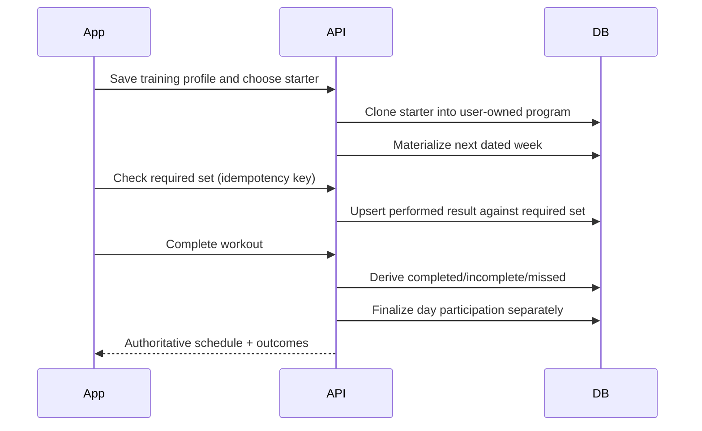
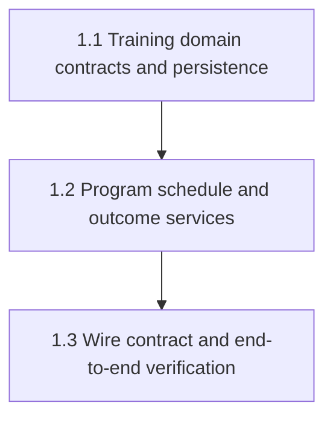

# Mainspec: Goal-based training API

## Outcome

The API becomes the authoritative record for a user's training profile,
user-owned program, dated scheduled-workout snapshots, performed sets, derived
workout status, and finalized day participation. Legacy weekly-plan endpoints
remain compatible but are no longer the model used by the new client.

## Current state

- `internal/model/types.go` stores only `weight_unit` and `weekly_goal` settings.
- `internal/model/plan.go` and `internal/dao/plan_dao.go` persist recurring
  weekday mappings plus overrides, not dated workout commitments.
- `internal/model/log.go`/`set_log.go` store performed sets without a stable
  required-set identity or scheduled-workout outcome.
- `internal/dao/stats_dao.go` derives streaks from any non-rest day log.
- `internal/router/router.go` has no program or dated schedule resources.

## Target contract

```go
type TrainingProfile struct {
    PrimaryGoal string   `json:"primary_goal"` // general_health|strength|hypertrophy|conditioning|power|body_composition
    AvailableDays []int  `json:"available_days"`
    UsualActivity string `json:"usual_activity"`
    Experience string    `json:"experience"`
    Equipment []string   `json:"equipment"`
    SessionDurationMinutes int `json:"session_duration_minutes"`
    Timezone string      `json:"timezone"`
}

type ScheduledWorkout struct {
    ID uuid.UUID `json:"id"`
    Date string `json:"date"`
    Name string `json:"name"`
    Status string `json:"status"` // planned|in_progress|completed|incomplete|missed
    FinalizedAt *time.Time `json:"finalized_at,omitempty"`
    RequiredSets []ScheduledSet `json:"required_sets"`
    ExtraSets []SetLog `json:"extra_sets"`
}
```

The exact persistence layout may differ, but the HTTP contract must preserve the
distinction between required set snapshots, extra performed sets, workout status,
and finalized day participation. Performed workout sessions and scheduled
workouts have stable UUIDs; dates are filters, never resource identity.

## Temporal flow



## Cross-repo dependency

The app consumes the versioned shapes documented in `docs/CONTRACTS.md`. API
slice 1.1 freezes the exact route/shape contract before app hooks or mocks are
implemented. API slice 1.2 must be complete before live-mode integration is done.

## Slice Dependency Map

| Slice | Depends On | Blocks |
|-------|------------|--------|
| 1.1 — Training domain contracts and persistence | — | 1.2 |
| 1.2 — Program, schedule, and outcome services | 1.1 | 1.3 |
| 1.3 — Wire contract and end-to-end verification | 1.2 | — |


